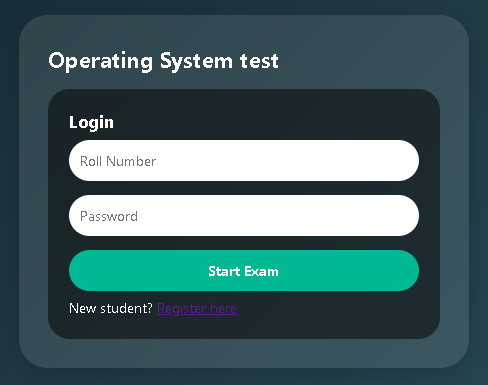
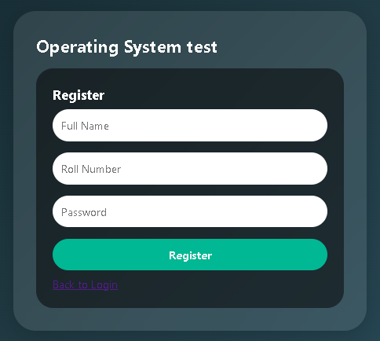
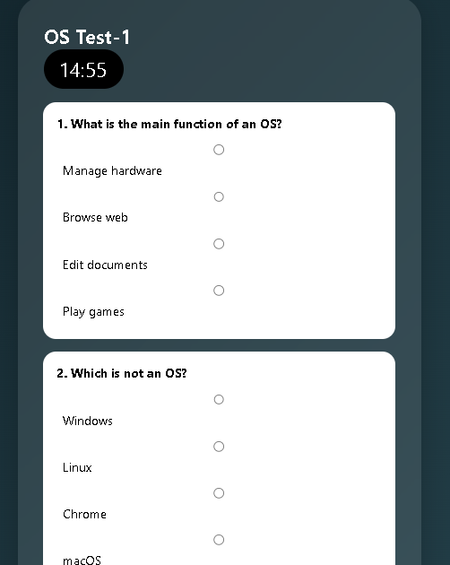

# OS_test

OS_test system for Operating System subject in Class room.
Students can register, login, take tests, and see results.  
Admin can manage students, questions, and export results.

### Login

### Register

### student_views

## Features
- Student registration & login
- Timed each test (15 min)
- Auto-score calculation
- Admin dashboard with CRUD
- CSV export results

## Technologies
- HTML, CSS, JavaScript
- PHP (Backend)
- MySQL (Database)
- XAMPP

## Installation
1. Clone this repo to `C:/xampp/htdocs/`
2. Import `database.sql` to phpMyAdmin
3. Open `http://localhost/os_test/`

## Usage
- Teacher creates WiFi hotspot
- Students connect and browse to teacher's IP